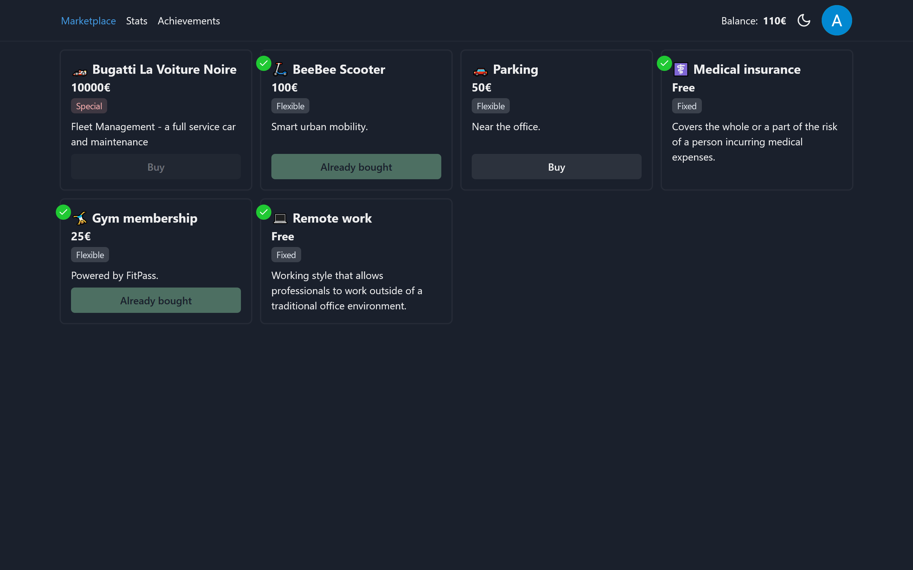

# [loyalty-program](https://loyalty-program.vercel.app/) 💰

Loyalty and Engagement program web app, powered by Notion as a database.

## License

This project is licensed under the MIT License - see the [LICENSE](LICENSE) file for details.
